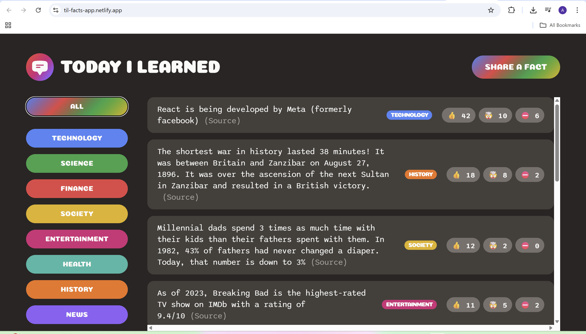

# Today I Learned 🧠


A simple full-stack web application where users can share interesting facts with others.

Users can submit new facts, categorize them, and vote on whether a fact is interesting, mind-blowing, or false.

This project was built using **React** for the frontend and **Supabase** as the backend database, and deployed on **Netlify**.

---

## 🌐 Live Demo

[](https://til-facts-app.netlify.app)

---

## App Preview



---

## 🚀 Features

- Share new facts with a source
- Categorize facts (Technology, Science, Finance, etc.)
- Vote on facts
- Filter facts by category
- Real-time data stored in Supabase
- Responsive UI

---

## 🛠 Tech Stack

Frontend

- React
- JavaScript
- CSS
- HTML

Backend

- Supabase (PostgreSQL)

Deployment

- Netlify

---

## 📂 Project Structure

```bash
today-i-learned-app
│
├── public
│ └── index.html
│
├── src
│ ├── App.js
│ ├── index.js
│ ├── style.css
│ └── supabase.js
│
├── package.json
└── README.md
```

---

## 💻 Run Locally

Clone the project

```bash
git clone https://github.com/YOUR-USERNAME/today-I-learned-app.git
```

Go to the project directory

```bash
cd today-i-learned-app
```

Install dependencies

```bash
npm install
```

Start the development server

```bash
npm start
```

The app will run on:

```bash
http://localhost:3000
```

---

## 📚 What I Learned

- Building React components
- Managing state in React
- Fetching data from Supabase
- CRUD operations with a backend database
- Deploying React apps with Netlify
- Using Git and GitHub for version control

## 👤 Author

Ashdeep Singh  
GitHub: https://github.com/Ashdeep71
